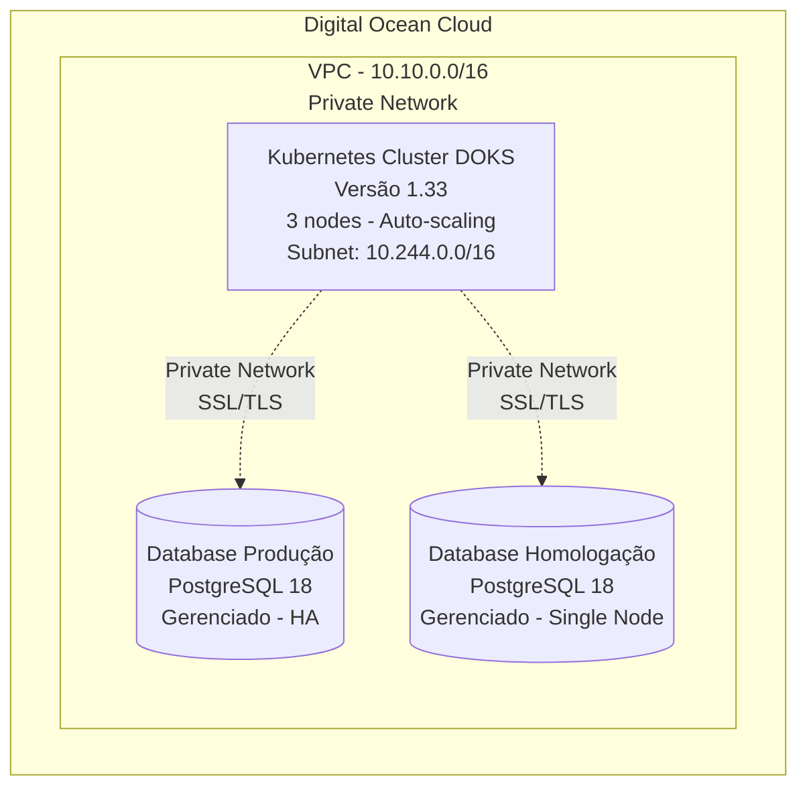

# Infraestrutura como Código - Digital Ocean

Este projeto contém a definição de infraestrutura na Digital Ocean usando Terraform, conforme especificado no [PRD de Infraestrutura Cloud](../docs/prd-infraestrutura-cloud-digitalocean.md).

## Arquitetura

A infraestrutura provisionada inclui:

- **VPC**: Rede privada isolada (10.10.0.0/16)
- **Kubernetes Cluster (DOKS)**: Cluster gerenciado versão 1.33 com auto-scaling (2-5 nodes)
- **Database PostgreSQL 18 (Produção)**: 2 nodes em High Availability
- **Database PostgreSQL 18 (Staging)**: 1 node para custo otimizado



## Pré-requisitos

Antes de começar, certifique-se de ter instalado:

1. **Terraform** >= 1.0
   ```bash
   # macOS
   brew install terraform

   # Linux
   wget https://releases.hashicorp.com/terraform/1.6.0/terraform_1.6.0_linux_amd64.zip
   unzip terraform_1.6.0_linux_amd64.zip
   sudo mv terraform /usr/local/bin/
   ```

2. **Digital Ocean CLI (doctl)**
   ```bash
   # macOS
   brew install doctl

   # Linux
   wget https://github.com/digitalocean/doctl/releases/download/v1.100.0/doctl-1.100.0-linux-amd64.tar.gz
   tar xf doctl-1.100.0-linux-amd64.tar.gz
   sudo mv doctl /usr/local/bin
   ```

3. **kubectl**
   ```bash
   # macOS
   brew install kubectl

   # Linux
   curl -LO "https://dl.k8s.io/release/$(curl -L -s https://dl.k8s.io/release/stable.txt)/bin/linux/amd64/kubectl"
   sudo install -o root -g root -m 0755 kubectl /usr/local/bin/kubectl
   ```

4. **Conta e Token da Digital Ocean**
   - Crie uma conta em https://cloud.digitalocean.com
   - Gere um token de API em https://cloud.digitalocean.com/account/api/tokens
   - O token precisa ter permissões de **leitura e escrita**

## Estrutura do Projeto

```
IaC/
├── README.md                          # Este arquivo
├── main.tf                            # Configuração principal
├── variables.tf                       # Definição de variáveis
├── outputs.tf                         # Outputs do projeto
├── versions.tf                        # Versões de providers
├── terraform.tfvars.example           # Exemplo de configuração
├── .gitignore                         # Ignore para Terraform
└── modules/
    ├── networking/                    # Módulo de VPC
    ├── kubernetes/                    # Módulo de Kubernetes DOKS
    └── database/                      # Módulo de Database PostgreSQL
```

## Início Rápido

### 1. Configuração Inicial

Clone o repositório e navegue até a pasta IaC:

```bash
cd IaC
```

### 2. Configure as Variáveis

Copie o arquivo de exemplo e configure suas variáveis:

```bash
cp terraform.tfvars.example terraform.tfvars
```

Edite `terraform.tfvars` e configure:

```hcl
do_token     = "dop_v1_seu_token_aqui"
project_name = "maratona-ia"
region       = "nyc1"
```

**IMPORTANTE**: Nunca commit o arquivo `terraform.tfvars` no Git!

### 3. Alternativa: Variáveis de Ambiente

Para maior segurança, use variáveis de ambiente:

```bash
export TF_VAR_do_token="dop_v1_seu_token_aqui"
export TF_VAR_project_name="maratona-ia"
export TF_VAR_region="nyc1"
```

### 4. Inicialize o Terraform

```bash
terraform init
```

Este comando irá:
- Baixar os providers necessários (Digital Ocean)
- Configurar o backend de estado

### 5. Planeje as Mudanças

Visualize o que será criado:

```bash
terraform plan
```

Revise cuidadosamente o output para garantir que está correto.

### 6. Aplique a Infraestrutura

Provisione a infraestrutura:

```bash
terraform apply
```

Digite `yes` quando solicitado para confirmar.

**Tempo estimado**: 10-15 minutos

### 7. Obtenha as Credenciais

Após a conclusão, salve o kubeconfig:

```bash
terraform output -raw kubeconfig_raw > kubeconfig.yaml
export KUBECONFIG=$(pwd)/kubeconfig.yaml
```

Verifique a conexão com o cluster:

```bash
kubectl cluster-info
kubectl get nodes
```

Obtenha as credenciais dos databases:

```bash
# Database de Produção
terraform output db_prod_private_uri

# Database de Staging
terraform output db_staging_private_uri
```

## Configurações Disponíveis

### Variáveis Obrigatórias

| Variável | Descrição | Exemplo |
|----------|-----------|---------|
| `do_token` | Token de API da Digital Ocean | `dop_v1_xxxxx` |
| `project_name` | Nome do projeto | `maratona-ia` |
| `region` | Região da Digital Ocean | `nyc1`, `sfo3`, `fra1` |

### Variáveis Opcionais do Kubernetes

| Variável | Padrão | Descrição |
|----------|--------|-----------|
| `k8s_version` | `1.33` | Versão do Kubernetes |
| `k8s_node_size` | `s-2vcpu-4gb` | Tamanho dos nodes |
| `k8s_node_count` | `3` | Número inicial de nodes |
| `k8s_auto_scale` | `true` | Habilitar auto-scaling |
| `k8s_min_nodes` | `2` | Mínimo de nodes |
| `k8s_max_nodes` | `5` | Máximo de nodes |

### Variáveis Opcionais do Database de Produção

| Variável | Padrão | Descrição |
|----------|--------|-----------|
| `db_prod_version` | `18` | Versão do PostgreSQL |
| `db_prod_size` | `db-s-2vcpu-4gb` | Tamanho do node |
| `db_prod_node_count` | `2` | Nodes (2 para HA) |
| `db_prod_storage_mb` | `51200` | Armazenamento (50GB) |

### Variáveis Opcionais do Database de Staging

| Variável | Padrão | Descrição |
|----------|--------|-----------|
| `db_staging_version` | `18` | Versão do PostgreSQL |
| `db_staging_size` | `db-s-1vcpu-2gb` | Tamanho do node |
| `db_staging_node_count` | `1` | Nodes (1 = single node) |
| `db_staging_storage_mb` | `25600` | Armazenamento (25GB) |

## Outputs

Após o `terraform apply`, você terá acesso aos seguintes outputs:

### Cluster Kubernetes
```bash
terraform output cluster_id
terraform output cluster_endpoint
terraform output -raw kubeconfig_raw > kubeconfig.yaml
```

### Database de Produção
```bash
terraform output db_prod_private_host
terraform output db_prod_port
terraform output db_prod_database_name
terraform output -raw db_prod_password
terraform output -raw db_prod_private_uri
```

### Database de Staging
```bash
terraform output db_staging_private_host
terraform output -raw db_staging_private_uri
```

### Comandos Úteis
```bash
terraform output quick_start_commands
```

## Operações Comuns

### Atualizar a Infraestrutura

Após modificar variáveis ou recursos:

```bash
terraform plan
terraform apply
```

### Escalar o Cluster

Modifique as variáveis de auto-scaling:

```hcl
k8s_min_nodes = 3
k8s_max_nodes = 10
```

Aplique:

```bash
terraform apply
```

### Upgrade de Database

Modifique a versão do PostgreSQL:

```hcl
db_prod_version = "19"
```

**ATENÇÃO**: Isso causará downtime. Agende uma janela de manutenção.

### Visualizar Estado Atual

```bash
terraform show
terraform state list
```

### Destruir a Infraestrutura

**CUIDADO**: Isso removerá todos os recursos!

```bash
terraform destroy
```

Digite `yes` para confirmar.

## Estimativa de Custos

### Configuração Padrão (Produção)

| Recurso | Especificação | Custo/mês |
|---------|---------------|-----------|
| Kubernetes | 3x s-2vcpu-4gb | ~$72 |
| DB Produção | db-s-2vcpu-4gb (2 nodes HA) | ~$120 |
| DB Staging | db-s-1vcpu-2gb (1 node) | ~$15 |
| VPC | Incluído | $0 |
| **Total** | | **~$207/mês** |

*Valores aproximados baseados no pricing da Digital Ocean em 2025.*

**Nota**: Os valores podem variar conforme a configuração escolhida no arquivo `terraform.tfvars`.

## Segurança

### Boas Práticas Implementadas

✅ **Private Networking**: Databases acessíveis apenas via VPC

✅ **SSL/TLS**: Obrigatório para conexões de database

✅ **Secrets Sensíveis**: Marcados como `sensitive` no Terraform

✅ **Firewall**: Database permite apenas acesso do cluster Kubernetes

✅ **High Availability**: Database de produção com 2 nodes

✅ **Backups Automáticos**: Habilitados por padrão

✅ **Auto-upgrade**: Patches de segurança aplicados automaticamente

### Recomendações Adicionais

1. **Use Backend Remoto**: Configure S3 ou Terraform Cloud para state remoto
2. **Habilite Encryption at Rest**: Para state files
3. **Implemente RBAC**: No cluster Kubernetes
4. **Rotate Credentials**: Regularmente
5. **Monitore Logs**: Habilite audit logs
6. **Use Secrets Manager**: Para gerenciamento de secrets

## Troubleshooting

### Erro: "Error creating Kubernetes cluster"

**Causa**: Token inválido ou sem permissões
**Solução**: Verifique se o token tem permissões de leitura e escrita

### Erro: "Resource not found"

**Causa**: Região não suporta o recurso solicitado
**Solução**: Mude a região ou verifique disponibilidade na documentação

### Erro: "Insufficient quota"

**Causa**: Limite de recursos atingido na sua conta
**Solução**: Solicite aumento de quota no suporte da Digital Ocean

### Cluster não acessível

```bash
# Regenere o kubeconfig
terraform output -raw kubeconfig_raw > kubeconfig.yaml

# Configure
export KUBECONFIG=$(pwd)/kubeconfig.yaml

# Teste
kubectl cluster-info
```

### State File Locked

```bash
# Remova o lock manualmente (use com cuidado!)
terraform force-unlock <LOCK_ID>
```

## Manutenção

### Janelas de Manutenção Configuradas

- **Kubernetes**: Domingo às 04:00 UTC
- **Database Produção**: Domingo às 03:00 UTC
- **Database Staging**: Sábado às 03:00 UTC

### Backups

- **Produção**: Retidos por 7 dias
- **Staging**: Retidos por 3 dias

Para restaurar um backup, use a console da Digital Ocean ou a API.

## Disaster Recovery

### Procedimento de Recuperação

1. Identifique o state file do Terraform
2. Execute `terraform destroy` se necessário
3. Execute `terraform apply` para recriar
4. Restaure databases a partir de backups
5. Valide estado da aplicação

### RTO/RPO

- **RTO (Recovery Time Objective)**: < 30 minutos
- **RPO (Recovery Point Objective)**: < 24 horas (backup diário)

## Módulos

O projeto é organizado em módulos reutilizáveis:

### [networking](modules/networking/)
Cria e gerencia a VPC privada

### [kubernetes](modules/kubernetes/)
Provisiona o cluster Kubernetes DOKS com auto-scaling

### [database](modules/database/)
Cria databases PostgreSQL gerenciados com HA

Cada módulo possui sua própria documentação em `modules/<nome>/README.md`.

## CI/CD

Para automatizar a aplicação da infraestrutura, integre com GitHub Actions:

```yaml
name: Terraform Apply

on:
  push:
    branches: [main]
    paths: ['IaC/**']

jobs:
  terraform:
    runs-on: ubuntu-latest
    steps:
      - uses: actions/checkout@v3

      - name: Setup Terraform
        uses: hashicorp/setup-terraform@v2

      - name: Terraform Init
        run: terraform init
        working-directory: ./IaC

      - name: Terraform Plan
        run: terraform plan
        working-directory: ./IaC
        env:
          TF_VAR_do_token: ${{ secrets.DO_TOKEN }}

      - name: Terraform Apply
        run: terraform apply -auto-approve
        working-directory: ./IaC
        env:
          TF_VAR_do_token: ${{ secrets.DO_TOKEN }}
```

## Referências

- [PRD - Infraestrutura Cloud Digital Ocean](../docs/prd-infraestrutura-cloud-digitalocean.md)
- [Terraform DigitalOcean Provider](https://registry.terraform.io/providers/digitalocean/digitalocean/latest/docs)
- [DigitalOcean Kubernetes Documentation](https://docs.digitalocean.com/products/kubernetes/)
- [DigitalOcean Managed Databases](https://docs.digitalocean.com/products/databases/)
- [Terraform Best Practices](https://www.terraform.io/docs/language/index.html)

## Suporte

Para dúvidas ou problemas:

1. Consulte a [documentação do Terraform](https://www.terraform.io/docs)
2. Consulte a [documentação da Digital Ocean](https://docs.digitalocean.com)
3. Abra uma issue no repositório do projeto

## Licença

Este projeto está sob a licença especificada no repositório principal.

---

**Última Atualização**: 2025-11-03
**Versão do Terraform**: >= 1.0
**Provider Digital Ocean**: ~> 2.0
