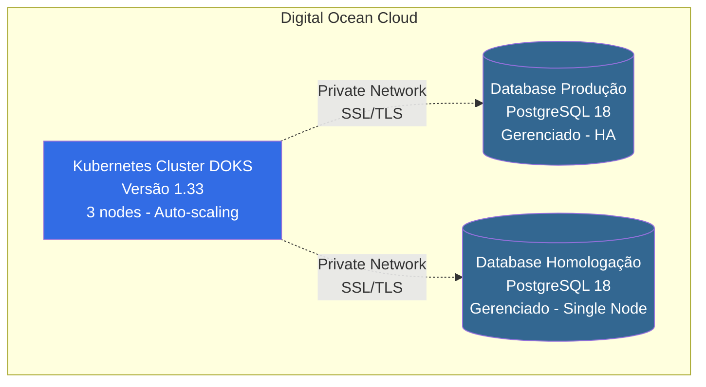

# PRD - Automação de Infraestrutura Cloud na Digital Ocean

## 1. Visão Geral do Produto

### 1.1 Objetivo
Automatizar o processo de criação e gerenciamento da infraestrutura de cloud para deploy de aplicações na Digital Ocean utilizando Terraform, garantindo reprodutibilidade, versionamento e práticas de Infrastructure as Code (IaC).

### 1.2 Contexto do Negócio
A necessidade de provisionar ambientes de forma manual é propensa a erros, inconsistências e demora no time-to-market. A automação da infraestrutura permite:
- Redução de tempo de provisionamento de ambientes
- Padronização de configurações entre ambientes
- Rastreabilidade através de versionamento de código
- Recuperação rápida de desastres
- Redução de custos operacionais

### 1.3 Público-Alvo
- Equipes de DevOps
- Engenheiros de Infraestrutura
- Desenvolvedores Backend/Full-Stack
- Equipes de SRE (Site Reliability Engineering)

### 1.4 Diagrama de Arquitetura



#### Componentes da Arquitetura

**Kubernetes Cluster (DOKS)**:
- Versão: 1.33
- Node Pool com auto-scaling (2-5 nodes)
- Gerenciado pela Digital Ocean
- Private networking habilitado

**Database de Produção**:
- PostgreSQL 18 gerenciado
- High Availability (2 nodes)
- Conexão via private network
- SSL/TLS obrigatório

**Database de Homologação**:
- PostgreSQL 18 gerenciado
- Single node (custo otimizado)
- Conexão via private network
- SSL/TLS obrigatório

## 2. Objetivos e Métricas de Sucesso

### 2.1 Objetivos
1. Provisionar cluster Kubernetes gerenciado na Digital Ocean
2. Criar database gerenciado para ambiente de produção
3. Criar database gerenciado para ambiente de homologação
4. Garantir isolamento e segurança entre ambientes
5. Permitir escalabilidade automática de recursos
6. Facilitar replicação de ambientes para DR (Disaster Recovery)

### 2.2 Métricas de Sucesso
- Tempo de provisionamento de ambiente completo: < 15 minutos
- Taxa de sucesso de provisionamento: > 99%
- Tempo de recuperação de ambiente (RTO): < 30 minutos
- Custo de infraestrutura otimizado através de sizing adequado
- Zero configurações manuais pós-provisionamento

## 3. Requisitos Funcionais

### 3.1 Cluster Kubernetes
**RF-001**: O sistema deve provisionar um cluster Kubernetes gerenciado (DOKS - DigitalOcean Kubernetes Service)

**Especificações**:
- Nome configurável do cluster
- Região configurável (padrão: nyc1)
- Versão do Kubernetes: utilizar versão stable mais recente
- Node Pool padrão:
  - Tipo de máquina: s-2vcpu-4gb (mínimo)
  - Quantidade de nodes: 3 (configurável)
  - Auto-scaling habilitado: min 2, max 5 nodes
- Integração com Container Registry da Digital Ocean
- High Availability para control plane (produção)

**RF-002**: O sistema deve configurar políticas de manutenção automática

**Especificações**:
- Auto-upgrade habilitado para patches de segurança
- Janela de manutenção: Domingo às 04:00 UTC
- Surge upgrade habilitado para minimizar downtime

**RF-003**: O sistema deve configurar rede e segurança do cluster

**Especificações**:
- VPC dedicada para isolamento de rede
- Subnet customizada para cluster (10.244.0.0/16)
- Subnet customizada para services (10.245.0.0/16)
- Firewall do control plane configurado com IPs permitidos
- Tags para organização: [environment, managed-by:terraform]

### 3.2 Database de Produção
**RF-004**: O sistema deve provisionar database gerenciado para produção

**Especificações**:
- Engine: PostgreSQL (versão 18)
- Nome: {projeto}-db-production
- Região: mesma do cluster Kubernetes
- Tamanho: db-s-2vcpu-4gb (mínimo recomendado para produção)
- Node count: 2 (HA - High Availability)
- Private networking: habilitado (mesma VPC do cluster)
- Storage: 50GB (expansível)
- Backup automático: habilitado
- Janela de manutenção: Domingo às 03:00 UTC
- Tags: [environment:production, managed-by:terraform]

**RF-005**: O sistema deve configurar usuário e database inicial de produção

**Especificações**:
- Database name: {projeto}_prod
- Criar usuário dedicado para aplicação (não usar doadmin)
- Configuração de SSL obrigatório para conexões
- Connection pooling habilitado (PgBouncer)

**RF-006**: O sistema deve expor outputs com credenciais de conexão

**Especificações**:
- Host privado e público
- Porta de conexão
- Nome do database
- Usuário
- Password (sensitive)
- Connection URI completa (sensitive)

### 3.3 Database de Homologação
**RF-007**: O sistema deve provisionar database gerenciado para homologação

**Especificações**:
- Engine: PostgreSQL (mesma versão da produção)
- Nome: {projeto}-db-staging
- Região: mesma do cluster Kubernetes
- Tamanho: db-s-1vcpu-2gb (menor que produção)
- Node count: 1 (single node - custo otimizado)
- Private networking: habilitado (mesma VPC do cluster)
- Storage: 25GB (expansível)
- Backup automático: habilitado
- Janela de manutenção: Sábado às 03:00 UTC (diferente de produção)
- Tags: [environment:staging, managed-by:terraform]

**RF-008**: O sistema deve configurar usuário e database inicial de homologação

**Especificações**:
- Database name: {projeto}_staging
- Criar usuário dedicado para aplicação
- Configuração de SSL habilitado
- Connection pooling habilitado

**RF-009**: O sistema deve expor outputs com credenciais de conexão de staging

**Especificações**:
- Host privado e público
- Porta de conexão
- Nome do database
- Usuário
- Password (sensitive)
- Connection URI completa (sensitive)

### 3.4 Configurações Avançadas
**RF-010**: O sistema deve permitir configuração de parâmetros de database

**Especificações**:
- Configuração de timezone
- Configuração de max_connections
- Configuração de shared_buffers
- Configuração de effective_cache_size
- Configuração de work_mem

**RF-011**: O sistema deve implementar firewall rules para databases

**Especificações**:
- Permitir acesso apenas da VPC do Kubernetes
- Bloquear acesso público por padrão
- Opcional: whitelist de IPs específicos para administração

## 4. Requisitos Não-Funcionais

### 4.1 Segurança
**RNF-001**: Todas as credenciais sensíveis devem ser marcadas como sensitive no Terraform

**RNF-002**: Comunicação entre cluster e databases deve usar private networking

**RNF-003**: SSL/TLS obrigatório para conexões de database

**RNF-004**: Secrets de database não devem ser commitados no repositório

**RNF-005**: Utilizar Terraform state remoto com encryption at rest

### 4.2 Disponibilidade
**RNF-006**: Database de produção deve ter SLA de 99.9% de uptime

**RNF-007**: Cluster Kubernetes deve ter High Availability control plane

**RNF-008**: Backups automáticos diários retidos por 7 dias (produção) e 3 dias (staging)

### 4.3 Performance
**RNF-009**: Latência de rede entre cluster e database < 5ms (private networking)

**RNF-010**: IOPS de database adequado para workload esperado

### 4.4 Escalabilidade
**RNF-011**: Cluster deve suportar auto-scaling de nodes (2-5 nodes)

**RNF-012**: Database deve permitir escalabilidade vertical sem downtime prolongado

**RNF-013**: Storage de database deve ser expansível sem downtime

### 4.5 Observabilidade
**RNF-014**: Habilitar métricas nativas da Digital Ocean para todos os recursos

**RNF-015**: Configurar alertas básicos para uso de CPU, memória e storage

**RNF-016**: Logs de database disponíveis para consulta

### 4.6 Manutenibilidade
**RNF-017**: Código Terraform deve seguir convenções de estilo (terraform fmt)

**RNF-018**: Código deve ser modularizado para reuso

**RNF-019**: Documentação inline com comentários explicativos

**RNF-020**: README com instruções de uso e pré-requisitos

### 4.7 Custo
**RNF-021**: Estimativa de custo mensal deve ser documentada

**RNF-022**: Utilizar recursos de menor custo para ambiente de homologação

**RNF-023**: Implementar tags para cost tracking

## 5. Escopo e Priorização

### 5.1 MVP (Minimum Viable Product)
**Prioridade Alta - Entrega 1**:
- Cluster Kubernetes básico (3 nodes fixos)
- Database PostgreSQL produção (single node)
- Database PostgreSQL staging (single node)
- Networking básico com VPC
- Outputs de conexão

### 5.2 Fase 2
**Prioridade Média - Entrega 2**:
- Auto-scaling do cluster
- High Availability para database de produção
- Configurações avançadas de database
- Firewall rules detalhadas
- Integração com Container Registry

### 5.3 Fase 3
**Prioridade Baixa - Melhorias Futuras**:
- Módulos Terraform reutilizáveis
- CI/CD para aplicação de infraestrutura
- Disaster Recovery automático
- Multi-region setup
- Monitoring e alerting avançado

## 6. Dependências e Pré-requisitos

### 6.1 Dependências Externas
- Conta ativa na Digital Ocean
- Token de API da Digital Ocean com permissões adequadas
- Terraform instalado (versão >= 1.0)
- kubectl instalado para acesso ao cluster
- doctl (Digital Ocean CLI) instalado

### 6.2 Pré-requisitos de Configuração
- VPC criada ou permitir criação automática
- Projeto na Digital Ocean para organização
- Budget alerts configurados na Digital Ocean
- Terraform backend configurado (S3, Terraform Cloud, ou DigitalOcean Spaces)

## 7. Estrutura do Projeto

### 7.1 Estrutura de Arquivos
```
infrastructure/
├── README.md
├── main.tf
├── variables.tf
├── outputs.tf
├── terraform.tfvars.example
├── versions.tf
├── modules/
│   ├── kubernetes/
│   │   ├── main.tf
│   │   ├── variables.tf
│   │   └── outputs.tf
│   ├── database/
│   │   ├── main.tf
│   │   ├── variables.tf
│   │   └── outputs.tf
│   └── networking/
│       ├── main.tf
│       ├── variables.tf
│       └── outputs.tf
└── environments/
    ├── production/
    │   └── terraform.tfvars
    └── staging/
        └── terraform.tfvars
```

### 7.2 Configuração de Providers
- Provider: digitalocean/digitalocean
- Versão mínima: ~> 2.0
- Provider: hashicorp/kubernetes (para configurações pós-provisionamento)

## 8. Variáveis de Configuração

### 8.1 Variáveis Obrigatórias
```hcl
do_token        # Token de API da Digital Ocean
project_name    # Nome do projeto (usado em nomes de recursos)
region          # Região da Digital Ocean (ex: nyc1, sfo3)
```

### 8.2 Variáveis Opcionais com Defaults
```hcl
k8s_version              # default: "1.33"
k8s_node_size            # default: "s-2vcpu-4gb"
k8s_node_count           # default: 3
k8s_auto_scale           # default: true
k8s_min_nodes            # default: 2
k8s_max_nodes            # default: 5

db_prod_engine           # default: "pg"
db_prod_version          # default: "18"
db_prod_size             # default: "db-s-2vcpu-4gb"
db_prod_node_count       # default: 2
db_prod_storage_mb       # default: 51200 (50GB)

db_staging_engine        # default: "pg"
db_staging_version       # default: "18"
db_staging_size          # default: "db-s-1vcpu-2gb"
db_staging_node_count    # default: 1
db_staging_storage_mb    # default: 25600 (25GB)

vpc_cidr                 # default: "10.10.0.0/16"
cluster_subnet           # default: "10.244.0.0/16"
service_subnet           # default: "10.245.0.0/16"

tags                     # default: ["managed-by:terraform"]
```

## 9. Outputs Esperados

### 9.1 Outputs do Cluster Kubernetes
```
cluster_id
cluster_name
cluster_endpoint
cluster_status
cluster_region
cluster_version
cluster_ipv4_address
kubeconfig_raw
node_pool_id
node_pool_nodes
```

### 9.2 Outputs do Database de Produção
```
db_prod_id
db_prod_host
db_prod_private_host
db_prod_port
db_prod_database_name
db_prod_user
db_prod_password (sensitive)
db_prod_uri (sensitive)
db_prod_private_uri (sensitive)
```

### 9.3 Outputs do Database de Staging
```
db_staging_id
db_staging_host
db_staging_private_host
db_staging_port
db_staging_database_name
db_staging_user
db_staging_password (sensitive)
db_staging_uri (sensitive)
db_staging_private_uri (sensitive)
```

### 9.4 Outputs de Networking
```
vpc_id
vpc_cidr
vpc_region
```

## 10. Casos de Uso

### 10.1 Provisionamento Inicial
**Ator**: DevOps Engineer

**Fluxo**:
1. Configurar variáveis no arquivo terraform.tfvars
2. Executar `terraform init`
3. Executar `terraform plan` para revisar mudanças
4. Executar `terraform apply` para provisionar infraestrutura
5. Aguardar conclusão (aproximadamente 10-15 minutos)
6. Coletar outputs para configuração de aplicação
7. Configurar kubectl com kubeconfig retornado
8. Validar conectividade com databases

### 10.2 Escalabilidade do Cluster
**Ator**: SRE

**Fluxo**:
1. Ajustar variáveis k8s_min_nodes e k8s_max_nodes
2. Executar `terraform plan` para validar mudanças
3. Executar `terraform apply`
4. Validar que auto-scaling está funcionando corretamente

### 10.3 Upgrade de Database
**Ator**: DBA/DevOps Engineer

**Fluxo**:
1. Atualizar variável db_prod_version ou db_staging_version
2. Executar `terraform plan` para revisar mudanças
3. Agendar janela de manutenção
4. Executar `terraform apply`
5. Validar conectividade pós-upgrade

### 10.4 Disaster Recovery
**Ator**: SRE

**Fluxo**:
1. Identificar estado do Terraform do ambiente
2. Executar `terraform destroy` se necessário remover recursos corrompidos
3. Executar `terraform apply` para recriar infraestrutura
4. Restaurar databases a partir de backups automáticos
5. Validar estado da aplicação

## 11. Considerações de Segurança

### 11.1 Gestão de Secrets
- Nunca commitar terraform.tfvars com valores reais
- Utilizar variáveis de ambiente para DO_TOKEN
- Considerar uso de Vault ou AWS Secrets Manager para gestão de secrets
- Marcar outputs sensíveis como sensitive = true

### 11.2 Controle de Acesso
- Implementar RBAC no cluster Kubernetes
- Utilizar service accounts dedicados para aplicações
- Limitar acesso ao database apenas através da VPC
- Implementar network policies no Kubernetes

### 11.3 Auditoria
- Habilitar audit logs no cluster Kubernetes
- Configurar logging de queries no database para produção
- Manter histórico de mudanças no Terraform state

## 12. Estimativa de Custos

### 12.1 Cluster Kubernetes
- 3 nodes s-2vcpu-4gb: ~$72/mês ($24/node)
- Load Balancer: ~$12/mês (se necessário)
- Total cluster: ~$84/mês

### 12.2 Database Produção
- PostgreSQL db-s-2vcpu-4gb (2 nodes HA): ~$120/mês
- Storage 50GB: incluído
- Total database produção: ~$120/mês

### 12.3 Database Staging
- PostgreSQL db-s-1vcpu-2gb (1 node): ~$15/mês
- Storage 25GB: incluído
- Total database staging: ~$15/mês

### 12.4 Networking
- VPC: gratuito
- Bandwidth: variável (primeiros 1TB incluídos)

**Estimativa Total Mensal: ~$219 USD/mês**

*Nota: Valores aproximados baseados em pricing da Digital Ocean em 2025. Sujeito a alterações.*

## 13. Cronograma Estimado

### Fase MVP (2-3 dias)
- Dia 1: Setup do projeto, configuração de providers, módulo de networking
- Dia 2: Implementação dos módulos de Kubernetes e Database
- Dia 3: Testes, ajustes, documentação

### Fase 2 (2-3 dias)
- Implementação de funcionalidades avançadas
- Testes de auto-scaling
- Refinamento de segurança

### Fase 3 (ongoing)
- Melhorias contínuas
- Monitoramento e otimização

## 14. Riscos e Mitigações

| Risco | Probabilidade | Impacto | Mitigação |
|-------|---------------|---------|-----------|
| Falha no provisionamento | Baixa | Alto | Validar terraform plan antes de apply, manter state backup |
| Estouro de custos | Média | Médio | Implementar budget alerts, revisar sizing regularmente |
| Downtime durante manutenção | Baixa | Médio | Agendar janelas de manutenção, usar HA para produção |
| Perda de dados | Muito Baixa | Muito Alto | Backups automáticos, testar restore regularmente |
| Indisponibilidade da região | Muito Baixa | Alto | Planejar multi-region para disaster recovery (Fase 3) |

## 15. Critérios de Aceitação

### 15.1 Funcionalidade
- [ ] Cluster Kubernetes provisionado com sucesso
- [ ] Database de produção operacional e acessível
- [ ] Database de staging operacional e acessível
- [ ] Comunicação entre cluster e databases através de private networking
- [ ] Outputs expostos corretamente
- [ ] Kubeconfig funcional

### 15.2 Segurança
- [ ] SSL habilitado para databases
- [ ] Credenciais marcadas como sensitive
- [ ] Firewall configurado adequadamente
- [ ] Sem secrets no código versionado

### 15.3 Documentação
- [ ] README com instruções completas
- [ ] Comentários inline no código
- [ ] Exemplo de terraform.tfvars
- [ ] Documentação de troubleshooting

### 15.4 Qualidade
- [ ] Código formatado com terraform fmt
- [ ] Terraform validate sem erros
- [ ] Terraform plan executado com sucesso
- [ ] Terraform apply executado com sucesso

## 16. Próximos Passos Após Aprovação

1. Setup do ambiente de desenvolvimento
2. Configuração do Terraform backend
3. Implementação dos módulos base
4. Testes em ambiente de desenvolvimento
5. Documentação técnica detalhada
6. Review de segurança
7. Testes de provisionamento completo
8. Handover para equipe de operações

## 17. Referências

- [Terraform DigitalOcean Provider Documentation](https://registry.terraform.io/providers/digitalocean/digitalocean/latest/docs)
- [DigitalOcean Kubernetes Documentation](https://docs.digitalocean.com/products/kubernetes/)
- [DigitalOcean Managed Databases Documentation](https://docs.digitalocean.com/products/databases/)
- [Terraform Best Practices](https://www.terraform.io/docs/language/index.html)
- [DigitalOcean API Documentation](https://docs.digitalocean.com/reference/api/)

## 18. Glossário

- **IaC**: Infrastructure as Code
- **DOKS**: DigitalOcean Kubernetes Service
- **HA**: High Availability
- **VPC**: Virtual Private Cloud
- **RBAC**: Role-Based Access Control
- **SLA**: Service Level Agreement
- **RTO**: Recovery Time Objective
- **DR**: Disaster Recovery
- **SRE**: Site Reliability Engineering

---

**Documento Preparado Por**: AI Agent (Claude)
**Data**: 2025-11-03
**Versão**: 1.0
**Status**: Proposta Inicial
